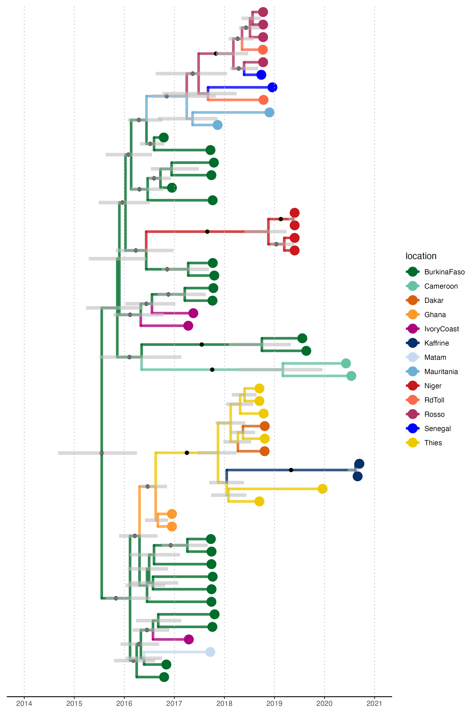

```{r echo = FALSE, message = FALSE}
library(lubridate)
```


```{css echo = FALSE}
.author, .title {
    display: none; 
}
.main-container{
    max-width: 75%;
}
body {
    background-color: maroon;
    color: white;
    font-size = 1.2vw;
}

```




Last Updated on `r today()`   
Site [developed](`r rmarkdown::metadata$github_repo`) by [Da_Ghost_Writer](mailto:`r rmarkdown::metadata$email_address`)